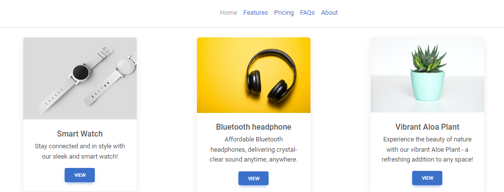

<!-- PROJECT LOGO -->
<br />
<div align="center">
  <a href="https://github.com/ml-cloud-playground/elara">
    
  </a>

  <h3 align="center">Using Vertex AI to Match Nonprofits with Customers</h3>

  <p align="left">
    This project discusses an experiment using Google's AI services and Vertex AI to match nonprofits with customers. The project utilized Charity Navigator's open dataset of nonprofit organizations. 
  </p>

  > This project is created as part of [Square + Google AI Hackathon](https://square-google-ai.devpost.com/)

</div>


<!-- TABLE OF CONTENTS -->
<details>
  <summary>Table of Contents</summary>
  <ol>
    <li>
      <a href="#about-the-project">About The Project</a>
      <ul>
        <li><a href="#built-with">Built With</a></li>
      </ul>
    </li>
    <li>
      <a href="#getting-started">Getting Started</a>
      <ul>
        <li><a href="#prerequisites">Prerequisites</a></li>
      </ul>
    </li>
    <li><a href="#license">License</a></li>
    <li><a href="#contact">Contact</a></li>
    <li><a href="#acknowledgments">Acknowledgments</a></li>
  </ol>
</details>


<!-- ABOUT THE PROJECT -->
## About The Project

This project is put together to try out Vertex AI machine learning platform from Google and Square API. The main objective of the project is to match a nonprofit with a potential customer at the point of sale (POS). 

According to a recent recent research over 4.1 billion raised for charities in three decades using POS transactions and donors report guilt as the major reason they give [1]. This test project attempts to shift the giving paradium from guilt to shared understanding and appreciation.

One of the benefits of doing such matching is to tailor the customer POS experience, to build a stronger bond and loyalty between a merchant and its customers.

<p align="right">(<a href="#readme-top">back to top</a>)</p>

### High level view
- Data from Charity Navigator's open data source for non profits is used to train an AI model to predict what non-profit category a customer is most likely to support based on a given input
- A GO front-end and back end application is used to serve HTML pages and act as a middle-tier business application


### Built With

* 
* 
* 
<p align="right">(<a href="#readme-top">back to top</a>)</p>


<!-- GETTING STARTED -->
## Getting Started

### Prerequisites

- Docker Desktop installed
- Go installed

### Running the code locally

1. Clone the repo
   ```sh
   git clone https://github.com/ml-cloud-playground/elara.git
   ```
2. API Configurations

    For Google's Vertex API, if there is a model already trained with the Kaggle Dataset you can replace the environment variables in middleware application Docker File.

    ```
    ENV elara_ml_access_token=ml_access_token
    ENV elara_ml_url=vertex_ai_endpoint
    ```

    For Square API, update the following values from `code>frontend>www>js>square.js`

    ```js
    const appId = '';
    const locationId = '';
    ```
    
1. Run make file

    ```sh
        cd /code
        make
    ```

<!-- LICENSE -->
## License

Distributed under the MIT License. See `LICENSE` for more information.

<p align="right">(<a href="#readme-top">back to top</a>)</p>


<!-- CONTACT -->
## Contact

Project Link: [https://github.com/ml-cloud-playground/elara](https://github.com/ml-cloud-playground/elara)

<p align="right">(<a href="#readme-top">back to top</a>)</p>


<!-- ACKNOWLEDGMENTS -->
## Acknowledgments

* Square team for API
* Google Cloud team for providing access to Vertex AI and cloud credits
* Charity navigator
* AlexGrohl - Indie Rock (track) - Hackathon submission

## Reference
[1] Caulfield, J.L., Baird, C.A. & Lee, F.K. The Ethicality of Point-of-Sale Marketing Campaigns: Normative Ethics Applied to Cause-Related Checkout Charities. J Bus Ethics 175, 799–814 (2022). https://doi.org/10.1007/s10551-020-04597-z

<p align="right">(<a href="#readme-top">back to top</a>)</p>